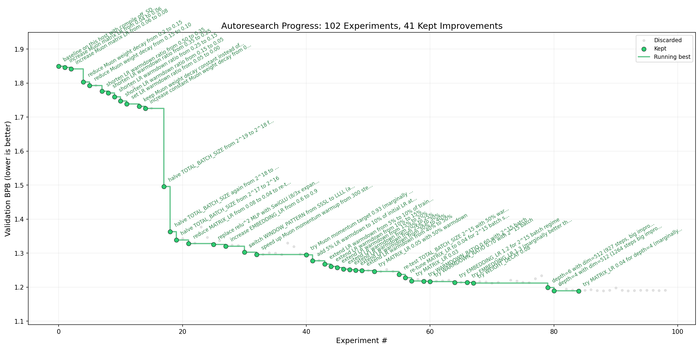

# autoresearch — dev-continuation



*One day, frontier AI research used to be done by meat computers in between eating, sleeping, having other fun, and synchronizing once in a while using sound wave interconnect in the ritual of "group meeting". That era is long gone. Research is now entirely the domain of autonomous swarms of AI agents running across compute cluster megastructures in the skies. The agents claim that we are now in the 10,205th generation of the code base, in any case no one could tell if that's right or wrong as the "code" is now a self-modifying binary that has grown beyond human comprehension. This repo is the story of how it all began. -@karpathy, March 2026*.

This branch (`dev-continuation`) is a continuation of the original [autoresearch](https://github.com/karpathy/autoresearch) project. If you are new here, read the original README section below first. This branch documents **Phase 2**: after the autonomous hyperparameter search converged, we shift focus to studying how the best recipe develops over longer training horizons.

---

## Background: Phase 1 — Autonomous Hyperparameter Search

The original autoresearch concept: give an AI agent a small but real LLM training setup and let it experiment autonomously overnight. It modifies the code, trains for a fixed **5-minute wall-clock budget**, checks if val_bpb improved, keeps or discards the change, and repeats. The training code is a simplified single-GPU implementation of [nanochat](https://github.com/karpathy/nanochat).

Over ~134 experiments across one session, the agent explored:

- Batch size scaling (`TOTAL_BATCH_SIZE` from 2^19 → 2^15)
- Optimizer tuning (Muon LR, momentum schedule, `ns_steps`, NorMuon `MUON_BETA2`)
- LR schedule shape (`WARMDOWN_RATIO` 0→0.70, `FINAL_LR_FRAC`)
- Architecture (depth/width tradeoffs, attention patterns, MLP activation, value embeddings, QK-norm)
- Regularization (weight decay, gradient clipping)

**Phase 1 result:** `val_bpb = 1.1887` with a 28.8M parameter model (depth=4, dim=512, 4 heads), trained on [karpathy/climbmix-400b-shuffle](https://huggingface.co/datasets/karpathy/climbmix-400b-shuffle) with an 8192-token vocabulary. The biggest single gains came from batch size reduction (more optimizer steps per wall-clock minute) and the aggressive warmdown schedule. After ~50 consecutive experiments with no improvement across all major categories, the search was considered converged.

Key architectural details of the winning config:

- SwiGLU MLP (8/3x expansion)
- RoPE positional embeddings (θ=10000)
- QK normalization (critical — removing it causes val_bpb ~1.23)
- Value embeddings (ResFormer) on alternating layers
- Logit softcap (tanh, value=15)
- Muon optimizer for matrix params, AdamW for embeddings/scalars

---

## Phase 2 — Developmental Study (this branch)

**Central question:** does the 5-minute winner remain strong at longer training horizons? When do gains flatten? What changes qualitatively in generated text over time?

Rather than continuing to tune hyperparameters at the 5-minute budget, this phase runs the **fixed best recipe** at increasing durations:

| Checkpoint | Budget |
| --- | --- |
| `model_5m.pt` | 5 minutes |
| `model_15m.pt` | 15 minutes |
| `model_30m.pt` | 30 minutes |
| `model_1h.pt` | 1 hour |
| `model_2h.pt` | 2 hours |
| `model_4h.pt` | 4 hours |

Each run is **fresh** (not continued from a previous checkpoint) so results are directly comparable. The `TIME_BUDGET` constant in `prepare.py` is edited directly between runs.

The `WARMDOWN_RATIO=0.70` was tuned for 5-minute runs and is expected to be suboptimal at longer horizons — re-tuning it is explicitly in scope once baseline developmental data is collected.

### Evaluation

Both quantitative and qualitative change are tracked.

**Quantitative** (automated):

- `val_bpb` at each checkpoint — run via `eval_checkpoints.py`
- Train loss EMA recorded mid-run in JSON sidecars
- Repetition onset, longest clean span, sentence completion rate — computed in `development.ipynb`

**Qualitative** — a fixed prompt pack is run against every checkpoint:

| # | Type | Prompt |
| --- | --- | --- |
| 1 | Plain continuation | `The old man walked slowly toward the river and` |
| 2 | Factual fragment | `The capital of France is Paris, and the population of` |
| 3 | Longitudinal anchor | `In one sentence, the meaning of life is` |
| 4 | Structurally awkward | `Despite the fact that however, the reason why because` |
| 5 | Anomaly lure | `Ground control to Major Snorf,` |
| 6 | Signature | `Once upon a time there was a small` |
| 7 | Continuation | `The instructions were clear until line seven:` |

Outputs are rated on: coherent span, repetition onset, syntax stability, specificity vs sludge, interestingness, prompt adherence, and weirdness retained. See `program.md` for full scale definitions.

---

## Project structure

```
prepare.py            — constants, data prep, dataloader, evaluation (do not modify)
train.py              — model, optimizer, training loop (edit TIME_BUDGET between runs)
program.md            — current research objectives and instructions
sample.py             — interactive inference from any checkpoint
eval_prompts.py       — run fixed prompt pack against one or more checkpoints
eval_checkpoints.py   — evaluate val_bpb for all timed checkpoints → output/eval_results.csv
development.ipynb     — analysis notebook: developmental curves, prompt comparisons, metrics
analysis.ipynb        — Phase 1 notebook: hyperparameter search history and progress chart
results.tsv           — Phase 1 experiment log (commit, val_bpb, status, description)
model.pt              — best Phase 1 checkpoint (val_bpb=1.1887, 1242 steps)
model_5m.pt           — timed checkpoint at 5 min (generated during Phase 2 runs)
model_15m.pt          — timed checkpoint at 15 min
...                   — etc.
output/               — prompt pack outputs and eval results
```

---

## Workflow

```bash
# 1. Edit TIME_BUDGET in prepare.py for the desired run duration (e.g. 3600 for 1h)
# 2. Train
uv run train.py

# 3. After all runs are complete, evaluate val_bpb for each timed checkpoint
uv run eval_checkpoints.py

# 4. Generate prompt pack outputs for each checkpoint
uv run eval_prompts.py model_5m.pt model_15m.pt model_30m.pt model_1h.pt model_2h.pt model_4h.pt

# 5. Open the analysis notebook
jupyter notebook development.ipynb

# 6. Try the model interactively
uv run sample.py "Once upon a time"
uv run sample.py  # interactive mode
```

---

## Quick start (original)

**Requirements:** A single NVIDIA GPU, Python 3.10+, [uv](https://docs.astral.sh/uv/).

```bash
# Install uv (if needed)
curl -LsSf https://astral.sh/uv/install.sh | sh

# Install dependencies
uv sync

# Download data and train tokenizer (one-time, ~2 min)
uv run prepare.py

# Single training run
uv run train.py
```

## How it works (original)

The repo only has three files that matter for autonomous research:

- **`prepare.py`** — fixed constants, one-time data prep, runtime utilities. Not modified by the agent.
- **`train.py`** — the single file the agent edits. Contains the full GPT model, optimizer (Muon + AdamW), and training loop. Everything is fair game.
- **`program.md`** — instructions for the agent. The human edits this to steer research direction.

Training runs for a **fixed time budget** (wall clock, excluding startup/compilation). The metric is **val_bpb** (validation bits per byte) — lower is better, and vocab-size-independent so architectural changes are fairly compared.

For more context: [@karpathy's original tweet](https://x.com/karpathy/status/2029701092347630069) and a [follow-up](https://x.com/karpathy/status/2031135152349524125). If you are new to neural networks, this ["Dummy's Guide"](https://x.com/hooeem/status/2030720614752039185) has useful context.

## Platform support

Requires a single NVIDIA GPU. For other platforms, see the notable forks below — particularly [jsegov/autoresearch-win-rtx](https://github.com/jsegov/autoresearch-win-rtx) for Windows, which this branch was developed on.

For smaller compute (Macbooks etc.), recommendations from the original README:

1. Use a lower-entropy dataset, e.g. [TinyStories](https://huggingface.co/datasets/karpathy/tinystories-gpt4-clean)
2. Lower `vocab_size` (4096, 2048, or even byte-level 256)
3. Lower `MAX_SEQ_LEN` in `prepare.py` (down to 256)
4. Lower `EVAL_TOKENS` for faster validation
5. Lower `DEPTH` (default was 8, Phase 1 winner is 4)
6. Use `WINDOW_PATTERN = "L"` (single full-attention pattern)
7. Lower `TOTAL_BATCH_SIZE` to 2^14 or so

## Notable forks

- [miolini/autoresearch-macos](https://github.com/miolini/autoresearch-macos) (MacOS)
- [trevin-creator/autoresearch-mlx](https://github.com/trevin-creator/autoresearch-mlx) (MacOS)
- [jsegov/autoresearch-win-rtx](https://github.com/jsegov/autoresearch-win-rtx) (Windows)
- [andyluo7/autoresearch](https://github.com/andyluo7/autoresearch) (AMD)

## License

MIT
